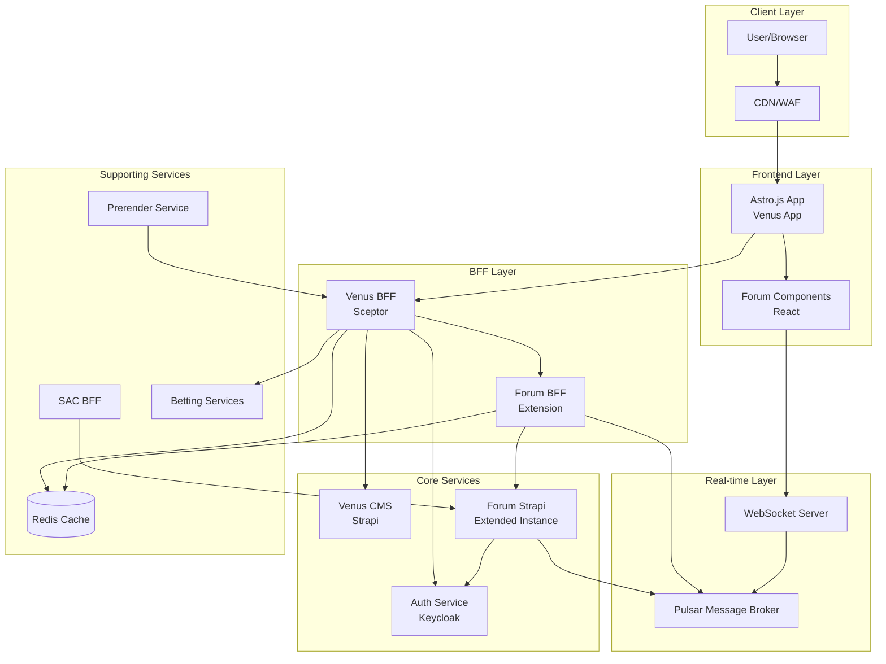
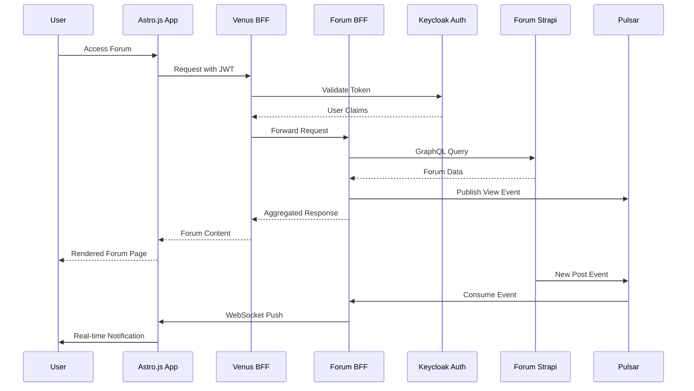

# Venus Forum Integration Strategy
## Strapi-Based Forum Integration for Betting Website Architecture

> **Source**: External competing plan, not authored by this team.
> **Status**: Reference only — not adopted. See analysis in `competing-plans-analysis.md`.

---

## Table of Contents
1. [Executive Summary](#executive-summary)
2. [Integration Architecture Diagram](#integration-architecture-diagram)
3. [Authentication Integration](#authentication-integration)
4. [BFF Layer Integration](#bff-layer-integration)
5. [CMS Integration](#cms-integration)
6. [Frontend Integration](#frontend-integration)
7. [Real-time Integration](#real-time-integration)
8. [SEO & Prerender Integration](#seo--prerender-integration)
9. [Implementation Roadmap](#implementation-roadmap)

---

## Executive Summary

This document outlines the integration strategy for adding a Strapi-based forum system to the existing Venus betting platform architecture. The forum will leverage existing infrastructure including Keycloak authentication, Strapi CMS, Pulsar messaging, and the Astro.js + React frontend stack.

### Key Integration Points
- **Authentication**: Keycloak SSO with JWT token propagation
- **CMS**: Extended Strapi instance with forum content types
- **BFF**: Venus BFF aggregates forum APIs with caching
- **Frontend**: Forum routes integrated into existing Astro.js app
- **Real-time**: Pulsar topics for notifications and live updates
- **SEO**: Prerender service integration for forum pages

---

## Integration Architecture Diagram

### High-Level Architecture



### Data Flow Diagram



---

## Authentication Integration

### 1. Keycloak Configuration for Forum

#### Realm Configuration
```json
{
  "realm": "venus-platform",
  "enabled": true,
  "clients": [
    {
      "clientId": "venus-forum-client",
      "name": "Venus Forum Client",
      "description": "Forum application client",
      "enabled": true,
      "clientAuthenticatorType": "client-secret",
      "secret": "${FORUM_CLIENT_SECRET}",
      "redirectUris": [
        "https://venus.com/forum/*",
        "https://venus.com/auth/callback"
      ],
      "webOrigins": ["https://venus.com"],
      "protocol": "openid-connect",
      "attributes": {
        "access.token.lifespan": "300",
        "refresh.token.lifespan": "1800"
      }
    }
  ],
  "roles": {
    "realm": [
      {
        "name": "forum-user",
        "description": "Basic forum user"
      },
      {
        "name": "forum-moderator",
        "description": "Forum moderator"
      },
      {
        "name": "forum-admin",
        "description": "Forum administrator"
      }
    ]
  }
}
```

#### User Attributes Mapping
```json
{
  "userProfile": {
    "attributes": [
      {
        "name": "forum_nickname",
        "displayName": "Forum Nickname",
        "validations": {
          "length": { "min": 3, "max": 30 },
          "pattern": { "pattern": "^[a-zA-Z0-9_]+$" }
        }
      },
      {
        "name": "forum_avatar",
        "displayName": "Forum Avatar URL"
      },
      {
        "name": "forum_reputation",
        "displayName": "Forum Reputation Score"
      },
      {
        "name": "forum_joined_date",
        "displayName": "Forum Join Date"
      }
    ]
  }
}
```

### 2. Strapi Authentication Middleware

```typescript
// forum-strapi/src/middlewares/keycloak-auth.ts
import { Context, Next } from 'koa';
import jwt from 'jsonwebtoken';
import jwksClient from 'jwks-rsa';

interface KeycloakToken {
  sub: string;
  preferred_username: string;
  email: string;
  realm_access?: {
    roles: string[];
  };
  resource_access?: {
    'venus-forum-client'?: {
      roles: string[];
    };
  };
}

const client = jwksClient({
  jwksUri: `${process.env.KEYCLOAK_URL}/realms/venus-platform/protocol/openid-connect/certs`,
  cache: true,
  rateLimit: true,
});

const getKey = (header: jwt.JwtHeader, callback: jwt.SigningKeyCallback) => {
  client.getSigningKey(header.kid, (err, key) => {
    if (err) return callback(err);
    const signingKey = key?.getPublicKey();
    callback(null, signingKey);
  });
};

export const keycloakAuth = () => {
  return async (ctx: Context, next: Next) => {
    const authHeader = ctx.headers.authorization;
    
    if (!authHeader?.startsWith('Bearer ')) {
      ctx.state.user = null;
      return next();
    }

    const token = authHeader.substring(7);

    try {
      const decoded = jwt.verify(token, getKey, {
        algorithms: ['RS256'],
        issuer: `${process.env.KEYCLOAK_URL}/realms/venus-platform`,
        audience: 'venus-forum-client',
      }) as KeycloakToken;

      const strapiUser = await syncKeycloakUser(decoded);
      
      ctx.state.user = strapiUser;
      ctx.state.keycloakToken = decoded;
      
    } catch (error) {
      ctx.state.user = null;
      strapi.log.warn('JWT validation failed:', error.message);
    }

    return next();
  };
};

async function syncKeycloakUser(keycloakUser: KeycloakToken) {
  const { sub: keycloakId, preferred_username: username, email } = keycloakUser;
  
  let user = await strapi.db.query('plugin::users-permissions.user').findOne({
    where: { keycloakId },
  });

  if (!user) {
    user = await strapi.db.query('plugin::users-permissions.user').create({
      data: {
        keycloakId,
        username,
        email,
        provider: 'keycloak',
        confirmed: true,
        blocked: false,
        role: await getDefaultForumRole(),
      },
    });

    await strapi.db.query('api::forum-profile.forum-profile').create({
      data: {
        user: user.id,
        nickname: username,
        reputation: 0,
        postCount: 0,
        joinedAt: new Date(),
      },
    });
  } else {
    await strapi.db.query('api::forum-profile.forum-profile').update({
      where: { user: user.id },
      data: { lastActiveAt: new Date() },
    });
  }

  return user;
}

async function getDefaultForumRole() {
  return strapi.db.query('plugin::users-permissions.role').findOne({
    where: { type: 'authenticated' },
  });
}
```

### 3. Venus BFF Auth Integration

```typescript
// venus-bff/src/middleware/auth.ts
import { Request, Response, NextFunction } from 'express';
import axios from 'axios';

interface AuthContext {
  userId: string;
  username: string;
  email: string;
  roles: string[];
  token: string;
  isAuthenticated: boolean;
}

declare global {
  namespace Express {
    interface Request {
      auth: AuthContext;
    }
  }
}

export const authMiddleware = async (
  req: Request,
  res: Response,
  next: NextFunction
) => {
  const authHeader = req.headers.authorization;

  if (!authHeader) {
    req.auth = {
      userId: '',
      username: 'anonymous',
      email: '',
      roles: ['anonymous'],
      token: '',
      isAuthenticated: false,
    };
    return next();
  }

  try {
    const introspectionResponse = await axios.post(
      `${process.env.KEYCLOAK_URL}/realms/venus-platform/protocol/openid-connect/token/introspect`,
      new URLSearchParams({
        token: authHeader.replace('Bearer ', ''),
        client_id: process.env.KEYCLOAK_CLIENT_ID!,
        client_secret: process.env.KEYCLOAK_CLIENT_SECRET!,
      }),
      {
        headers: { 'Content-Type': 'application/x-www-form-urlencoded' },
      }
    );

    const tokenData = introspectionResponse.data;

    if (!tokenData.active) {
      return res.status(401).json({ error: 'Invalid or expired token' });
    }

    req.auth = {
      userId: tokenData.sub,
      username: tokenData.preferred_username,
      email: tokenData.email,
      roles: [
        ...(tokenData.realm_access?.roles || []),
        ...(tokenData.resource_access?.['venus-forum-client']?.roles || []),
      ],
      token: authHeader.replace('Bearer ', ''),
      isAuthenticated: true,
    };

    next();
  } catch (error) {
    console.error('Auth validation error:', error);
    return res.status(500).json({ error: 'Authentication service error' });
  }
};

export const requireRole = (...allowedRoles: string[]) => {
  return (req: Request, res: Response, next: NextFunction) => {
    if (!req.auth.isAuthenticated) {
      return res.status(401).json({ error: 'Authentication required' });
    }

    const hasRole = allowedRoles.some((role) => req.auth.roles.includes(role));
    
    if (!hasRole) {
      return res.status(403).json({ error: 'Insufficient permissions' });
    }

    next();
  };
};
```

### 4. Frontend SSO Implementation

```typescript
// astro-app/src/lib/auth/keycloak.ts
import Keycloak from 'keycloak-js';

const keycloakConfig = {
  url: import.meta.env.PUBLIC_KEYCLOAK_URL,
  realm: 'venus-platform',
  clientId: 'venus-forum-client',
};

let keycloakInstance: Keycloak | null = null;

export const initKeycloak = async (): Promise<Keycloak> => {
  if (keycloakInstance) return keycloakInstance;

  keycloakInstance = new Keycloak(keycloakConfig);

  try {
    const authenticated = await keycloakInstance.init({
      onLoad: 'check-sso',
      silentCheckSsoRedirectUri: `${window.location.origin}/silent-check-sso.html`,
      pkceMethod: 'S256',
    });

    if (authenticated) {
      scheduleTokenRefresh();
    }

    return keycloakInstance;
  } catch (error) {
    console.error('Keycloak initialization failed:', error);
    throw error;
  }
};

const scheduleTokenRefresh = () => {
  if (!keycloakInstance) return;

  const expiresIn = (keycloakInstance.tokenParsed?.exp || 0) * 1000 - Date.now();
  const refreshTime = Math.max(expiresIn - 60000, 10000);

  setTimeout(async () => {
    try {
      await keycloakInstance?.updateToken(30);
      scheduleTokenRefresh();
    } catch (error) {
      console.error('Token refresh failed:', error);
      keycloakInstance?.login();
    }
  }, refreshTime);
};

export const getKeycloak = (): Keycloak | null => keycloakInstance;

export const getAuthHeaders = (): Record<string, string> => {
  if (!keycloakInstance?.token) return {};
  
  return {
    Authorization: `Bearer ${keycloakInstance.token}`,
    'X-User-Roles': keycloakInstance.tokenParsed?.realm_access?.roles?.join(',') || '',
  };
};
```

---

## BFF Layer Integration

### 1. Forum BFF Service Structure

```typescript
// forum-bff/src/index.ts
import express from 'express';
import cors from 'cors';
import helmet from 'helmet';
import compression from 'compression';
import { createProxyMiddleware } from 'http-proxy-middleware';
import { authMiddleware } from './middleware/auth';
import { cacheMiddleware } from './middleware/cache';
import { rateLimiter } from './middleware/rateLimiter';
import { errorHandler } from './middleware/errorHandler';
import { forumRoutes } from './routes/forum';
import { notificationRoutes } from './routes/notifications';
import { searchRoutes } from './routes/search';

const app = express();

app.use(helmet());
app.use(cors({
  origin: process.env.ALLOWED_ORIGINS?.split(',') || ['https://venus.com'],
  credentials: true,
}));
app.use(compression());
app.use(express.json());
app.use(rateLimiter);
app.use(authMiddleware);
app.use(cacheMiddleware);

app.use('/api/forum', forumRoutes);
app.use('/api/notifications', notificationRoutes);
app.use('/api/search', searchRoutes);

app.use(errorHandler);

const PORT = process.env.PORT || 4001;
app.listen(PORT, () => {
  console.log(`Forum BFF running on port ${PORT}`);
});
```

### 2. Forum Routes with Aggregation

```typescript
// forum-bff/src/routes/forum.ts
import { Router } from 'express';
import { graphqlRequest } from '../utils/graphql';
import { publishEvent } from '../utils/pulsar';
import { cache } from '../utils/cache';

const router = Router();

router.get('/categories', async (req, res, next) => {
  try {
    const cacheKey = `forum:categories:${req.query.locale || 'en'}`;
    
    const cached = await cache.get(cacheKey);
    if (cached && !req.query.refresh) {
      return res.json(cached);
    }

    const query = `
      query GetForumCategories($locale: I18NLocaleCode) {
        forumCategories(locale: $locale, sort: "order:asc") {
          data {
            id
            attributes {
              name
              slug
              description
              icon
              order
              forums {
                data {
                  id
                  attributes {
                    name
                    slug
                    description
                    topicCount
                    postCount
                    lastPostAt
                    moderators {
                      data {
                        attributes {
                          nickname
                          avatar
                        }
                      }
                    }
                  }
                }
              }
            }
          }
        }
      }
    `;

    const result = await graphqlRequest(query, { locale: req.query.locale });
    
    const categories = result.forumCategories.data.map((cat: any) => ({
      id: cat.id,
      name: cat.attributes.name,
      slug: cat.attributes.slug,
      description: cat.attributes.description,
      icon: cat.attributes.icon,
      forums: cat.attributes.forums.data.map((forum: any) => ({
        id: forum.id,
        name: forum.attributes.name,
        slug: forum.attributes.slug,
        stats: {
          topics: forum.attributes.topicCount,
          posts: forum.attributes.postCount,
          lastActivity: forum.attributes.lastPostAt,
        },
        moderators: forum.attributes.moderators.data.map((m: any) => ({
          nickname: m.attributes.nickname,
          avatar: m.attributes.avatar,
        })),
      })),
    }));

    await cache.set(cacheKey, { categories }, 300);
    res.json({ categories });
  } catch (error) {
    next(error);
  }
});

router.post('/forums/:slug/topics', async (req, res, next) => {
  try {
    if (!req.auth.isAuthenticated) {
      return res.status(401).json({ error: 'Authentication required' });
    }

    const { slug } = req.params;
    const { title, content, tags } = req.body;

    const rateKey = `post:limit:${req.auth.userId}`;
    const postCount = await cache.incr(rateKey);
    if (postCount === 1) {
      await cache.expire(rateKey, 60);
    }
    if (postCount > 5) {
      return res.status(429).json({ error: 'Rate limit exceeded' });
    }

    const mutation = `
      mutation CreateTopic($data: TopicInput!) {
        createTopic(data: $data) {
          data {
            id
            attributes {
              title
              slug
              createdAt
            }
          }
        }
      }
    `;

    const result = await graphqlRequest(mutation, {
      data: {
        title,
        content,
        forum: { connect: [{ slug }] },
        author: { connect: [{ keycloakId: req.auth.userId }] },
        tags: tags ? { connect: tags.map((id: string) => ({ id })) } : undefined,
      },
    }, req.auth.token);

    await cache.delPattern(`forum:${slug}:topics:*`);
    await cache.del('forum:categories:*');

    await publishEvent('forum.topic.created', {
      topicId: result.createTopic.data.id,
      forumSlug: slug,
      authorId: req.auth.userId,
      title,
      timestamp: new Date().toISOString(),
    });

    res.status(201).json({
      topic: result.createTopic.data,
    });
  } catch (error) {
    next(error);
  }
});

export { router as forumRoutes };
```

### 3. Caching Strategy

```typescript
// forum-bff/src/utils/cache.ts
import Redis from 'ioredis';

const redis = new Redis({
  host: process.env.REDIS_HOST,
  port: parseInt(process.env.REDIS_PORT || '6379'),
  password: process.env.REDIS_PASSWORD,
  db: parseInt(process.env.REDIS_DB || '0'),
});

export const cache = {
  async get(key: string): Promise<any> {
    const value = await redis.get(key);
    return value ? JSON.parse(value) : null;
  },

  async set(key: string, value: any, ttlSeconds: number): Promise<void> {
    await redis.setex(key, ttlSeconds, JSON.stringify(value));
  },

  async del(key: string): Promise<void> {
    await redis.del(key);
  },

  async delPattern(pattern: string): Promise<void> {
    const keys = await redis.keys(pattern);
    if (keys.length > 0) {
      await redis.del(...keys);
    }
  },

  async incr(key: string): Promise<number> {
    return redis.incr(key);
  },

  async expire(key: string, seconds: number): Promise<void> {
    await redis.expire(key, seconds);
  },

  async getOrSet<T>(
    key: string,
    factory: () => Promise<T>,
    ttlSeconds: number
  ): Promise<T> {
    const cached = await this.get(key);
    if (cached !== null) {
      return cached;
    }

    const value = await factory();
    await this.set(key, value, ttlSeconds);
    return value;
  },
};
```

### 4. Error Handling Pattern

```typescript
// forum-bff/src/middleware/errorHandler.ts
import { Request, Response, NextFunction } from 'express';

export class ForumError extends Error {
  constructor(
    public statusCode: number,
    message: string,
    public code: string,
    public details?: Record<string, any>
  ) {
    super(message);
    this.name = 'ForumError';
  }
}

export const errorHandler = (
  err: Error,
  req: Request,
  res: Response,
  next: NextFunction
) => {
  console.error('Error:', err);

  if (err instanceof ForumError) {
    return res.status(err.statusCode).json({
      error: {
        message: err.message,
        code: err.code,
        details: err.details,
      },
    });
  }

  res.status(500).json({
    error: {
      message: process.env.NODE_ENV === 'production' 
        ? 'Internal server error' 
        : err.message,
      code: 'INTERNAL_ERROR',
    },
  });
};
```

---

## CMS Integration

### 1. Strapi Content Types for Forum

```javascript
// forum-strapi/src/api/forum-category/content-types/forum-category/schema.json
{
  "kind": "collectionType",
  "collectionName": "forum_categories",
  "info": {
    "name": "Forum Category",
    "description": "Top-level forum categories"
  },
  "attributes": {
    "name": { "type": "string", "required": true, "maxLength": 100 },
    "slug": { "type": "uid", "targetField": "name", "required": true },
    "description": { "type": "text", "maxLength": 500 },
    "icon": { "type": "string" },
    "order": { "type": "integer", "default": 0 },
    "forums": {
      "type": "relation",
      "relation": "oneToMany",
      "target": "api::forum.forum",
      "mappedBy": "category"
    },
    "isVisible": { "type": "boolean", "default": true },
    "requiredRole": {
      "type": "enumeration",
      "enum": ["anonymous", "authenticated", "moderator", "admin"],
      "default": "anonymous"
    }
  }
}
```

### 2. Strapi Lifecycle Hooks

```javascript
// forum-strapi/src/api/topic/content-types/topic/lifecycles.js
module.exports = {
  async afterCreate(event) {
    const { result } = event;
    
    await strapi.db.query('api::forum.forum').update({
      where: { id: result.forumId },
      data: {
        $inc: { topicCount: 1 },
        lastPostAt: new Date(),
      },
    });

    await strapi.db.query('api::forum-profile.forum-profile').update({
      where: { id: result.authorId },
      data: {
        $inc: { topicCount: 1 },
        lastActiveAt: new Date(),
      },
    });

    await strapi.service('api::topic.topic').publishEvent('topic.created', {
      topicId: result.id,
      forumId: result.forumId,
      authorId: result.authorId,
      title: result.title,
    });
  },
};
```

---

## Frontend Integration

### 1. Forum API Client

```typescript
// astro-app/src/lib/forum/api.ts
const BFF_URL = import.meta.env.PUBLIC_BFF_URL || 'http://localhost:4000';

async function fetchBFF(endpoint: string, context: any, options: any = {}) {
  const url = `${BFF_URL}${endpoint}`;
  const authHeader = context.request.headers.get('authorization');
  const token = authHeader?.replace('Bearer ', '') || 
                context.cookies.get('auth_token')?.value;

  const headers: Record<string, string> = {
    'Content-Type': 'application/json',
    ...options.headers,
  };

  if (token) {
    headers['Authorization'] = `Bearer ${token}`;
  }

  const response = await fetch(url, {
    method: options.method || 'GET',
    headers,
    body: options.body ? JSON.stringify(options.body) : undefined,
  });

  if (!response.ok) {
    const error = await response.json().catch(() => ({ message: 'Unknown error' }));
    throw new Error(error.message || `HTTP ${response.status}`);
  }

  return response.json();
}

export async function getForumCategories(context: any) {
  return fetchBFF('/api/forum/categories', context);
}

export async function createTopic(forumSlug: string, data: any, context: any) {
  return fetchBFF(`/api/forum/forums/${forumSlug}/topics`, context, {
    method: 'POST',
    body: data,
  });
}

export async function searchForum(query: string, filters: any, context: any) {
  const params = new URLSearchParams({ q: query });
  return fetchBFF(`/api/forum/search?${params}`, context);
}
```

### 2. State Management with Zustand

```typescript
// astro-app/src/stores/forumStore.ts
import { create } from 'zustand';
import { persist, createJSONStorage } from 'zustand/middleware';

interface ForumState {
  preferences: {
    topicsPerPage: number;
    defaultSort: string;
    showSignatures: boolean;
  };
  drafts: Record<string, { title: string; content: string; savedAt: string }>;
  setPreference: (key: string, value: any) => void;
  saveDraft: (key: string, draft: { title: string; content: string }) => void;
  deleteDraft: (key: string) => void;
}

export const useForumStore = create<ForumState>()(
  persist(
    (set) => ({
      preferences: {
        topicsPerPage: 20,
        defaultSort: 'lastActivity:desc',
        showSignatures: true,
      },
      drafts: {},
      setPreference: (key, value) =>
        set((state) => ({
          preferences: { ...state.preferences, [key]: value },
        })),
      saveDraft: (key, draft) =>
        set((state) => ({
          drafts: {
            ...state.drafts,
            [key]: { ...draft, savedAt: new Date().toISOString() },
          },
        })),
      deleteDraft: (key) =>
        set((state) => {
          const { [key]: _, ...rest } = state.drafts;
          return { drafts: rest };
        }),
    }),
    {
      name: 'venus-forum-storage',
      storage: createJSONStorage(() => localStorage),
    }
  )
);
```

---

## Real-time Integration

### 1. Pulsar Topic Design

```yaml
topics:
  - name: "forum.user.activity"
    partitions: 6
    retention: "7d"
  - name: "forum.content.created"
    partitions: 12
    retention: "30d"
  - name: "forum.content.updated"
    partitions: 6
    retention: "14d"
  - name: "forum.notifications"
    partitions: 6
    retention: "3d"
  - name: "forum.moderation.actions"
    partitions: 3
    retention: "90d"
  - name: "forum.analytics"
    partitions: 12
    retention: "90d"
  - name: "forum.user.presence"
    partitions: 6
    compaction:
      enabled: true
      threshold: "1GB"
```

### 2. WebSocket Server

```typescript
// forum-ws-server/src/index.ts
import { Server } from 'socket.io';
import { createAdapter } from '@socket.io/redis-adapter';

const io = new Server({
  cors: {
    origin: process.env.ALLOWED_ORIGINS?.split(',') || ['https://venus.com'],
    credentials: true,
  },
  transports: ['websocket', 'polling'],
});

io.on('connection', (socket) => {
  socket.on('forum:subscribe', (forumId: string) => {
    socket.join(`forum:${forumId}`);
  });

  socket.on('topic:subscribe', (topicId: string) => {
    socket.join(`topic:${topicId}`);
  });

  socket.on('topic:typing', (data: { topicId: string; isTyping: boolean }) => {
    socket.to(`topic:${data.topicId}`).emit('topic:userTyping', {
      userId: socket.data.user?.sub,
      isTyping: data.isTyping,
    });
  });
});
```

---

## SEO & Prerender Integration

### 1. SEO Metadata Component

```astro
---
// ForumSEO.astro
const { title, description, type = 'website', publishedAt, author, breadcrumbs = [] } = Astro.props;
const currentUrl = Astro.url.href;
---

<title>{title} | Venus Forum</title>
<meta name="description" content={description} />
<link rel="canonical" href={currentUrl} />
<meta property="og:title" content={title} />
<meta property="og:description" content={description} />
<meta property="og:type" content={type} />
<meta property="og:url" content={currentUrl} />

<script type="application/ld+json" set:html={JSON.stringify({
  '@context': 'https://schema.org',
  '@type': type === 'article' ? 'DiscussionForumPosting' : 'WebPage',
  headline: title,
  description: description,
  url: currentUrl,
  datePublished: publishedAt,
  author: author ? { '@type': 'Person', name: author } : undefined,
  breadcrumb: breadcrumbs.length > 0 ? {
    '@type': 'BreadcrumbList',
    itemListElement: breadcrumbs.map((crumb, index) => ({
      '@type': 'ListItem',
      position: index + 1,
      name: crumb.name,
      item: crumb.url,
    })),
  } : undefined,
})} />
```

### 2. Sitemap Generation

```typescript
// forum-bff/src/routes/sitemap.ts
import { Router } from 'express';

const router = Router();

router.get('/sitemap-forum.xml', async (req, res, next) => {
  try {
    const baseUrl = process.env.SITE_URL || 'https://venus.com';
    // Fetch all forum content and generate XML sitemap
    // Categories, forums, topics all included
    // Cache-Control: public, max-age=3600
  } catch (error) {
    next(error);
  }
});

export { router as sitemapRoutes };
```

---

## Implementation Roadmap

### Phase 1: Foundation (Weeks 1-2)
- Set up Forum Strapi instance with content types
- Configure Keycloak realm and client for forum
- Implement authentication middleware in Strapi
- Create basic BFF endpoints for forum data

### Phase 2: Core Features (Weeks 3-4)
- Implement forum category and forum listing
- Build topic creation and viewing
- Add post/reply functionality
- Integrate with existing Venus frontend

### Phase 3: Real-time & Notifications (Weeks 5-6)
- Set up Pulsar topics for forum events
- Implement WebSocket server
- Add notification system
- Enable real-time updates

### Phase 4: User Features (Weeks 7-8)
- User profiles and reputation system
- Search functionality
- Moderation tools
- User preferences

### Phase 5: SEO & Performance (Weeks 9-10)
- Integrate with prerender service
- Implement sitemap generation
- Add structured data
- Performance optimization

### Phase 6: Launch Preparation (Week 11-12)
- Security audit
- Load testing
- Documentation
- Soft launch with beta users

---

## API Endpoints Reference

| Endpoint | Method | Description | Auth Required |
|----------|--------|-------------|---------------|
| `/api/forum/categories` | GET | List all categories | No |
| `/api/forum/forums/:slug/topics` | GET | List forum topics | No |
| `/api/forum/forums/:slug/topics` | POST | Create new topic | Yes |
| `/api/forum/topics/:slug` | GET | Get topic with posts | No |
| `/api/forum/topics/:slug/replies` | POST | Add reply | Yes |
| `/api/forum/users/:username/profile` | GET | Get user profile | No |
| `/api/forum/search` | GET | Search forum | No |

---

*Document Version: 1.0*
*Last Updated: 2024*
